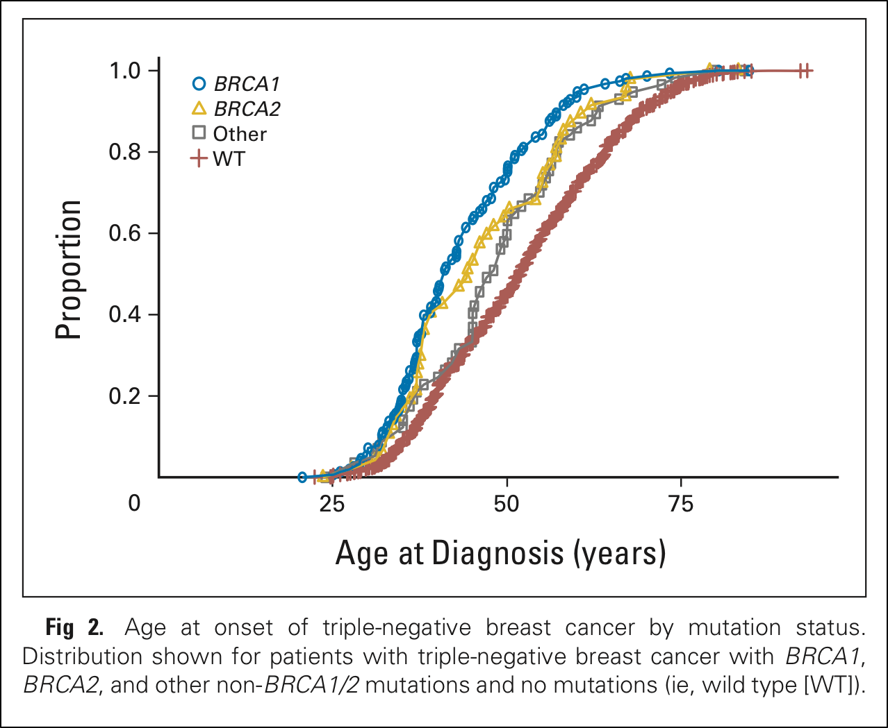

# STAT545-hw01-thibodeau-mylinh

Comment: I will be using this README.md file to track what I have learned in this homework. This is the first homework with GitHub and Markdown and I am looking forward to learning how to use these resources optimally. 
* Files opened locally on RStudio.
* Then pushed to Github with Git.
* I have also made and RMarkdown file (.Rmd) that contains some Gapminder data exercises

***
## A little history of Git, Github and My Linh 
### Once upon a time in a computer far far far away ...
> A student started to learn about two brothers with confusing names: Git and Github. 

There is something I don't quite understand in the tree.

> As the student didn't know the exact relationship between the brothers, several problems arised. RStudio tried to make the brothers talk to each other, but they were always out of sync. 

There was a conflict message when trying to committ the changes made in RStudio to Github via Git:
'commit' is not possible because you have unmerged files

> Luckily for the student, internet came to the rescue! 

  [A previous gitgub discussion from STAT545](https://github.com/STAT545-UBC/Discussion/issues/16)
  
  [A stack overflow discussion](https://stackoverflow.com/questions/9282632/git-index-lock-file-exists-when-i-try-to-commit-but-cannot-delete-the-file)

> But that only worked some times, with the recursive strategy, as the underlying problem persisted: she was unable still unable to make Git talk to his brother, Github. 

After many unsuccessful attempts to push my local data (personal computer) to Github, and with the help of Vincenzo and Pedro, I realized I had inadvertently created a Git repository within a Git repository.

I had the Git version of Inception, except that instead of having a dream inside a dream, I had a Git repository inside a Git repository. If you have an iphone and are able to talk to Siri, I recommend you ask her the following question: "Siri, what is the movie Inception about?"

***
### Eventually, the student finally started the assignment.

I will use the topic of my research, hereditary cancer predisposition syndromes, to learn the diverse features of RMarkdown.

Here is a list of some high penetrance hereditary cancer genes:   
*BRCA1*  
*BRCA2*  
*TP53*  
*PTEN*  
*CDH1*  
*STK11*  
*MLH1*  
*MSH2*  
*MSH6*  
*PMS2*  
*MUTYH*  
*APC*  
*SMAD4*  
*BMPR1A*  

I found this list on the [Hereditary Cancer Program Panel website](http://www.ccgenomics.ca/available-tests.html)

**Red flags for hereditary cancer syndromes:**  
1. Cancer in two or more close relatives  
2. Young age at cancer onset (<50 years)  
3. Two or more tumours arising from different primary sites (synchronous or metachronous)  
4. Two or more tumours arising simultaneously in same organ or bilateral origin (synchronous)  
5. Rare tumours associated with specific cancer syndromes (e.g. medullary thyroid cancer and Multiple Endocrine Neoplasia type 1 syndrome)  
Source: Hampel, H. et al. A practice guideline from the American College of Medical Genetics and Genomics and the National Society of Genetic Counselors: referral indications for cancer predisposition assessment. Genet Med 17, 70–87 (2014).

### An example: Hereditary Breast and Ovarian Cancer (HBOC) syndrome

The importance of detecting germline mutations in hereditary cancer predisposition genes resides in the fact that the medical and/or surgical management of such individuals can be tailored to their cancer risk.

Considering triple negative breast cancer cases, the age of onset is much earlier in individuals with high penetrance hereditary breast and ovarian cancer syndrome, as illustrated by the image below (Couch et al. 2015).

  

Source of image: Couch, F. J. et al. Inherited Mutations in 17 Breast Cancer Susceptibility Genes Among a Large Triple-Negative Breast Cancer Cohort Unselected for Family History of Breast Cancer. Journal of Clinical Oncology 33, 304–311 (2015).

***
# Life of a graduate student
```{r}
Here is an example of R code block inserted with Markdown:
days_week <- c("Monday", "Tuesday", "Wednesday", "Thursday", "Friday", "Saturday", "Sunday")
work_hours <- seq(40, 76)
my_data <- data.frame(days_week, work_hours)
View(my_data)
library(dplyr)
library(ggplot2)
pdf("StudentLife.pdf")
ggplot(data=my_data, aes(x=days_week, y = work_hours), na.rm=TRUE)+
  geom_bar(data=my_data, fill = "purple", stat = "identity", na.rm=TRUE)
dev.off()
```


***
